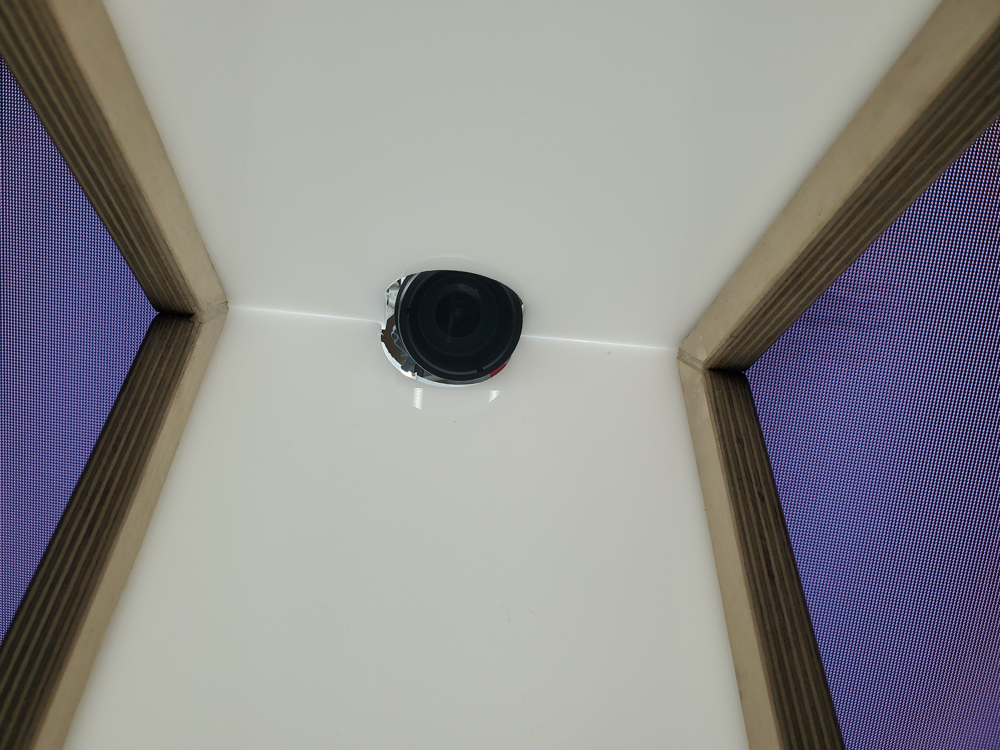
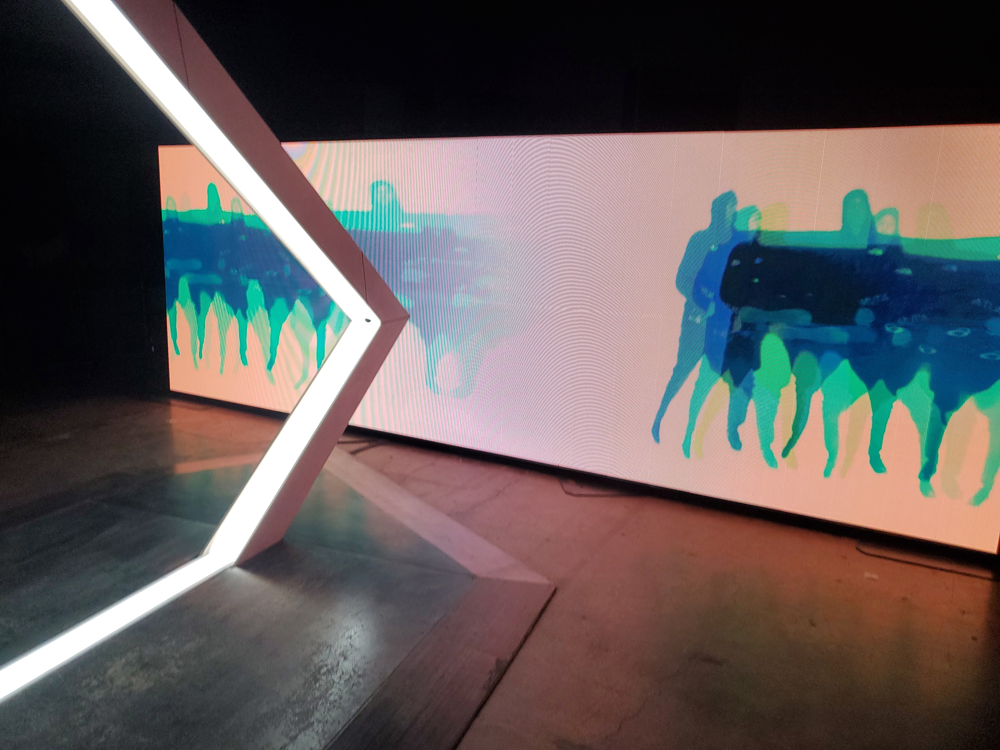

# BIAN

L'affiche de l'exposition: [Site de l'exposition](https://www.elektramontreal.ca/biennale2022?lang=fr)
#
L'oeuvre Résonance, était en exposition pendant ma visite a l'Arsenal art contemporain de Montréal.
J'ai visiter cette exposition le 3 février 2023 a l'exposition BIAN.

C'est moi sur la droite :smiley: :thumbsup:
#
## Résonances

Source: [Site de l'oeuvre](https://www.elektramontreal.ca/biennale2022?lang=fr)
#
## Type d'exposition
Résonances est une exposition qui se passe a l'intérieure et qui est temporaire, elle ne va pas rester là pour toujours. Elle a été créée par l,artiste Louis-Phillippe Rondeau en 2021

## Description de l'oeuvre
RÉSONANCES est une métaphore sur le temps qui défile. Toutefois, au lieu d’exprimer la linéarité du temps, cette installation interactive évoque la manière dont les gestes du présent se superposent à ceux du passé. Tel un écho visuel et sonore, RÉSONANCES représente nos actions antérieures qui resurgissent, amplifiant le présent, et devenant à leur tour passé, telle une perpétuelle mise en abyme temporelle. Cette boucle visuelle et sonore permet à l’interacteur de chorégraphier son présent en le construisant sur son propre passé, de manière ludique et singulière. La pièce a été dévoilée en décembre 2021 lors de l’exposition CORPS DATA à l’Ilot Balmoral en collaboration avec ELEKTRA .
[L'information sur l'expoistion](http://patenteux.com/wp/portfolio/resonances-2021/)

L'oeuvre résonnace est un installation Intéractive
Voici une vidéo pour vous la démontrez.
Type d'installation: Interactive: [Video intéractif](https://youtu.be/2OLwPezuT4A)

# Plus d'information
Photo de mise en espace

L'oeuvre est placé dans un endroit ou tu peux la voir directement en rentrant. Elle prend beaucoup de place car pour cette oeuvre, il faut un très grand écran et une grosse structure pour q'une personne soit capable de passé dedans. Aussi, la structure est placé juste devant le grand écran.

Pour l'exposition soit eposée, il faut avoir c'est composant technique.:
* La structure principale pour avoir un espace ou le sujet puisse passé.
* Une caméra pour capturer le sujet qui passe dans la structure.
* Des lumières blanche pour illuminer le sujet qui passe dans la structure.
* Un très grand écran pour aficher le sujet qui est passé dans la structure.

Photo de la structure

Photo de la caméra

Photo des lumières

Photo de l'écran

Pour l'exposition soit exposée, il faut que la salle d'exposition aille.
* Des caches files

L'exposition est très indépendante alors elle na pas besoin de beacoup de chose de la place d'exposition.

## Expérience vécue
Ce qui est attendu d'un visiteur avec cette oeuvre c'est que le visiteur passe a travers la strucutre puis qu'il regarde les images de lui sur le grand écran devant la strucutre. Pour moi cette expérience était très amusant. Faire drole de visage puis les voir apraître sur le grand écran, ou laisser mon bras plus lontemps devant la caméra pour me donner de long bras, très drole.

## Ce qui ma plus
J'ai bien aimé pourvoir voir des images de mois ce déplacer de droite a gauche sur le grand écran. Tu pouvais juste passé dans la structure puis ensuite en une seconde voir une image de toi sur l'écran. J'ai vraiment aimé comment l'oeuvre était rapidement réactive. Pas de gros delai, presque instantaner. C'est très impressionant, une des raison pourquoi j'ai bein apprécier l'oeuvre. :heart:

## Quelque chose que je ne changerais pas.
Une chose que je trouve que je ne pourrais pas enlever, sa serait le grand écran. Le fait que cette écran soit aussi gros fait de l'oeuvre une oeuvre super impressionante. Cette écran est vraiment la chose qui vien donner l'effet "WOW" a tout ceux qui viennent la voir.

