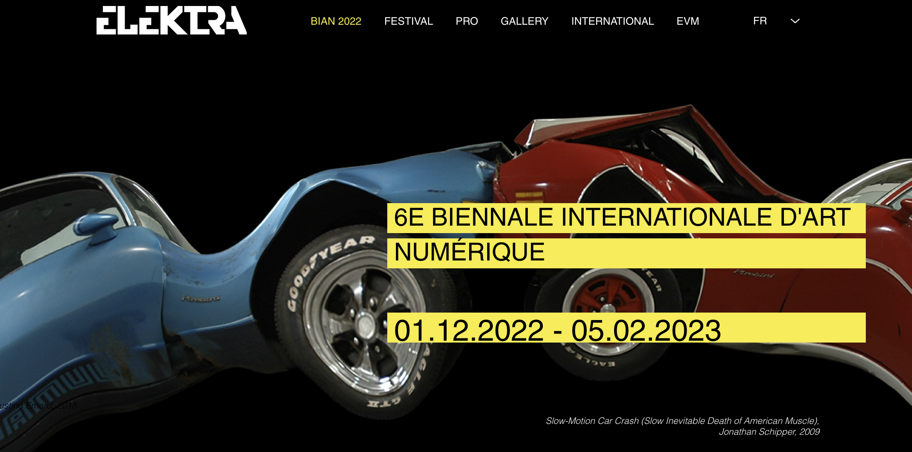
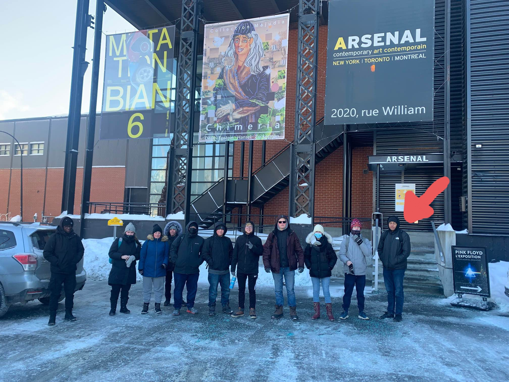
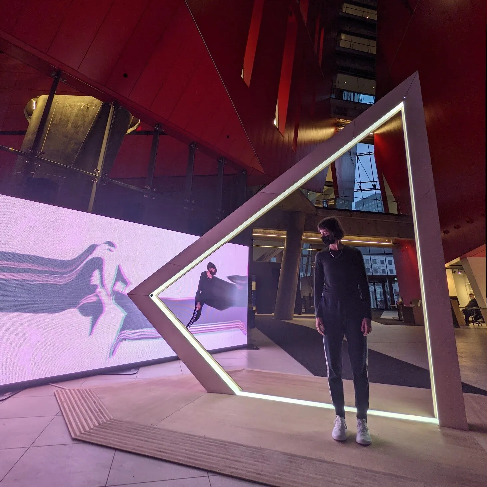
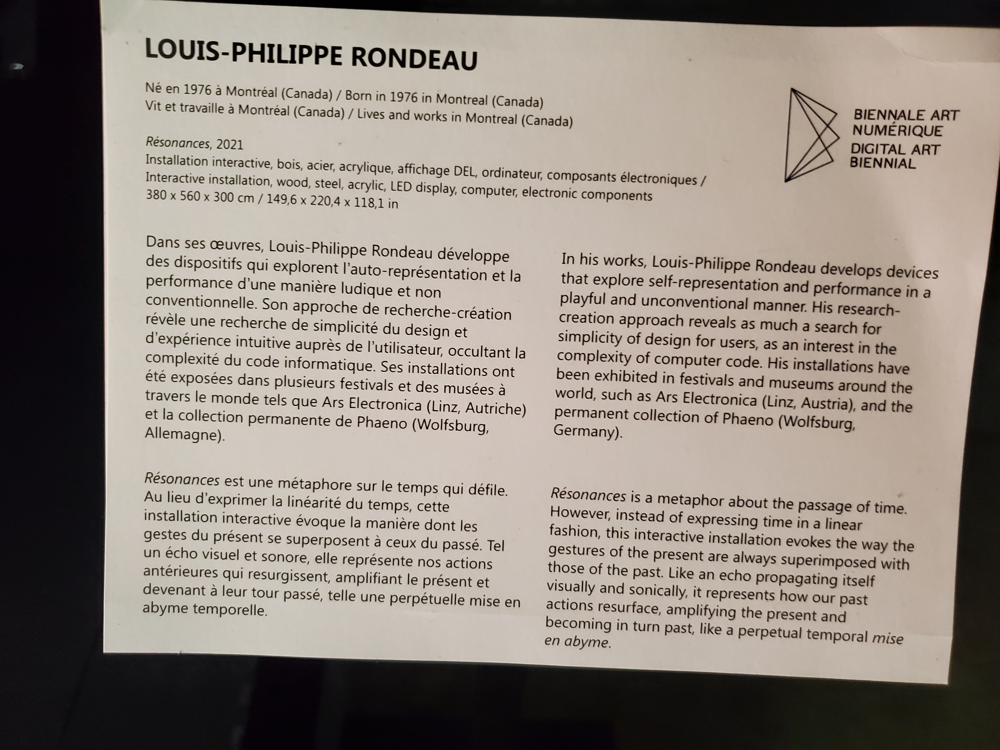
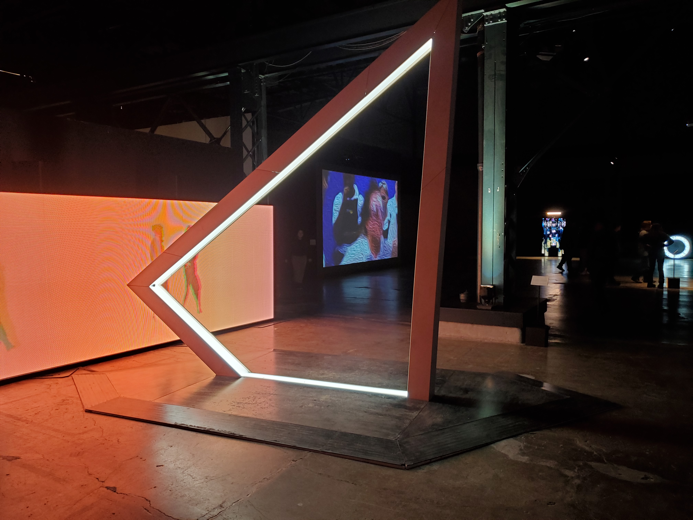

# BIAN

L'affiche de l'exposition:[Site de l'exposition](https://www.elektramontreal.ca/biennale2022?lang=fr)
#
**L'oeuvre Résonance, était en exposition pendant ma visite a l'Arsenal art contemporain de Montréal.
J'ai visiter cette exposition le 3 février 2023 a l'exposition BIAN.**

C'est moi sur la droite :smiley: :thumbsup:
#
## Résonances

Source: [Site de l'exposition](https://www.elektramontreal.ca/biennale2022?lang=fr)
#

## Type d'exposition
Résonances est une exposition qui se passe a l'intérieure et qui est temporaire, elle ne va pas rester là pour toujours.

Nom de l'artiste: Louis-Philippe Rondeau

Année de réalisation: 2021

RÉSONANCES est une métaphore sur le temps qui défile. Toutefois, au lieu d’exprimer la linéarité du temps, cette installation interactive évoque la manière dont les gestes du présent se superposent à ceux du passé. Tel un écho visuel et sonore, RÉSONANCES représente nos actions antérieures qui resurgissent, amplifiant le présent, et devenant à leur tour passé, telle une perpétuelle mise en abyme temporelle. Cette boucle visuelle et sonore permet à l’interacteur de chorégraphier son présent en le construisant sur son propre passé, de manière ludique et singulière. La pièce a été dévoilée en décembre 2021 lors de l’exposition CORPS DATA à l’Ilot Balmoral en collaboration avec ELEKTRA .

RESONANCES is a metaphor for the passage of time. However, instead of expressing the linearity of time, this interactive installation evokes the way in which the actions of the present are overlapping with those of the past. Like a visual and sound echo, RESONANCES represents our previous actions that resurface, amplifying the present, and becoming in turn past, like a perpetual temporal mise en abyme. This visual and sound loop allows the interactor to choreograph their present by building it on their own past, in a playful and singular way. The piece was unveiled in December 2021 during the CORPS DATA exhibition at the Ilot Balmoral in collaboration with ELEKTRA.
[L'information sur l'expoistion](http://patenteux.com/wp/portfolio/resonances-2021/)

L'oeuvre résonnace est un installation Intéractive
Voici une vidéo pour vous le démontrez.
Type d'installation: Interactive: [Video interactif](https://youtu.be/2OLwPezuT4A)

Photo de mise en espace

L'oeuvre est placé dans un endroit ou tu peux la voir directement en rentrant. Elle prend beaucoup de place car pour cette oeuvre, il faut un très grand écran et une grosse structure pour q'une personne soit capable de passé dedans. Aussi, la structure est placé juste devant le grand écran.

Pour l'exposition soit eposée, il faut avoir c'est composant technique.:
* La structure principale pour avoir un espace ou le sujet puisse passé.
* Une caméra pour capturer le sujet qui passe dans la structure.
* Des lumières blanche pour illuminer le sujet qui passe dans la structure.
* Un très grand écran pour aficher le sujet qui est passé dans la structure.

Photo de la structure

Photo de la caméra

Photo des lumières

Photo de l'écran

Pour l'exposition soit exposée, il faut que la salle d'exposition 

Élément nécessaire a l'exposition (cable, projecteur, etc.)

Expérience vécue	Posture du visiteur ou gestes de l'interacteur 🎥 possibilité d'intégrer de courts vidéos pour documenter les actions de l'oeuvre ou l'interactivité avec celle-ci	Texte qui explique ce qui est attendu du visiteur ou de l'interacteur. Où et comment se positionne-t-il/elle? Que faut-il faire? Comment l'oeuvre réagit-elle (si interactive)? Plus personnellement, description de l'expérience que l'oeuvre vous a fait vivre.

❤️ Ce qui vous a plu, vous a donné des idées	Éléments pertinents	Texte à rédiger qui présente un ou des aspects inspirants, avec justifications détaillées (pourquoi est-ce que cela vous a plus/ vous a donné des idées ?

🤔 Aspect que vous ne souhaiteriez pas retenir pour vos propres créations ou que vous feriez autrement	Éléments pertinents	Texte à rédiger qui présente un ou des aspects que vous ne retiendriez pas ou feriez autrement, avec justifications détaillées (pourquoi? comment?)

