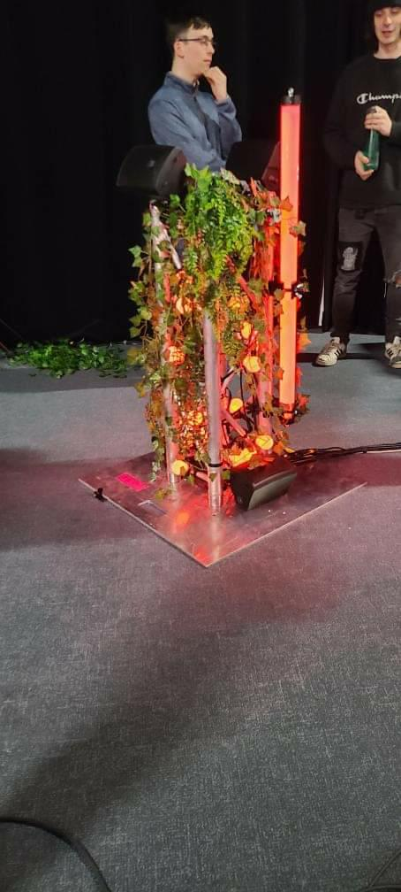
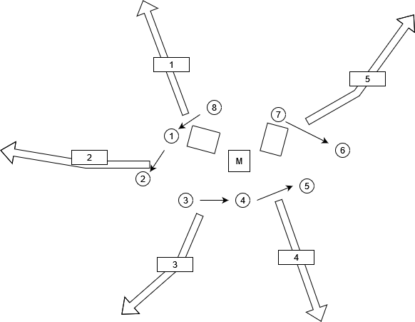

# EDRIA
Créé par Elwin Durand, Loic Delorme, Dominic Roberts, Gabriel Leblanc, Meryem Berbiche, Jean-Christophe Zephir.

## L'installation en cours

## Lien avec Mycelium
Le projets EDRIA, fait un lien avec la nature et la technologie. Ils utilisent des fausses plantes dans leur installations pour faire penser au arbres, en même temps il utilise la technologie pour les lumières.
## Schéma de l'installation

Source de l'image: [Leur site web](https://tim-montmorency.com/2023/projets/EDRIA/docs/web/preproduction.html)

## Cours nécéssaire
Trois cours du programme qui sont nécéssaire à la création de ce projets.
* Animation 2d
* Installation mulitimédia
* Conception d'une expérience multimédia
## Composante technique
Pour ce projet, un capteur de.

## Mon ressenti 
Je pense que quand je vais expériementé l'oeuvre, je vais être imprsionné pas la place que l'oeuvre va prendre. Dans le shéma d'installation il est prévu que l'oeuvre va prendre beaucoup de place. Avec les lumières et le son ambiants, je pense que sa va très immersif.

