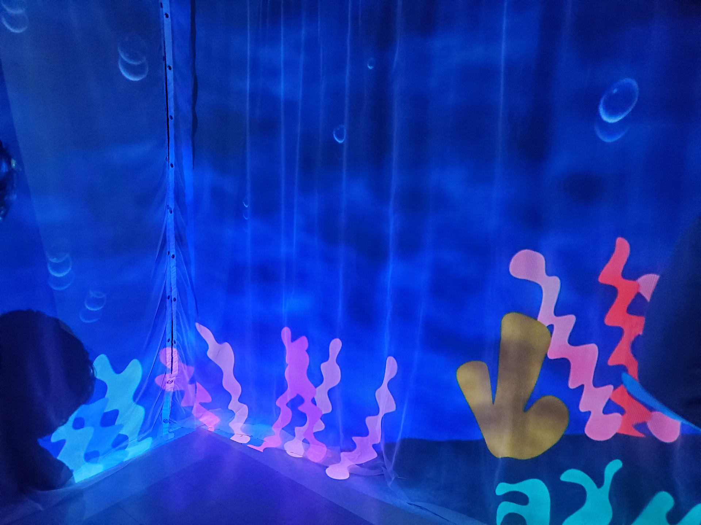

# Echomarine
Créé par Florence Lapierre, Natacha Abdallah, Tracy Gua, Maria Laura Coronel.

## L'installation en cours

## Lien avec Mycélium
Le projet Echomarine, fait un lien avec la nature et la technologie. Avec la technologie, il donnera l'impression d'être sous l'eau et de voir des animaux marins.
## Schéma de l'installation

Source de l'image: [Leur site web](https://tim-montmorency.com/2023/projets/Echomarine/docs/web/preproduction.html)

## Cours nécessaire
Trois cours du programme qui sont nécessaires à la création de ce projet.
* Animation 2D
* Intégration Web
* Traitement vidéo
## Composante technique
Pour ce projet, des projecteurs devront être placés de façons que les animaux puissent se promener sans coupure d'un mur à l'autre. Comme ces projecteurs devront couvrir les quatre murs de la salle, la position de ces projecteurs devra être presque parfaite.

## Mon ressenti 
Je pense que quand je vais expérimenter l'œuvre, je pense que ça va être impressionnant à cause des animaux qui vont se promener de mur en mur.

