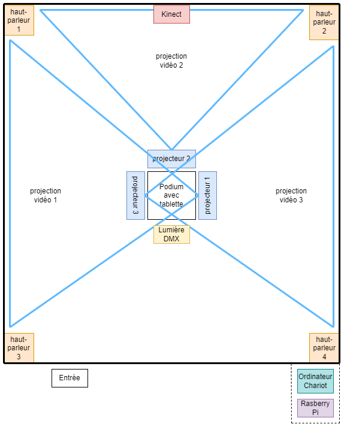

# Echomarine
Créé par Florence Lapierre, Natacha Abdallah, Tracy Gua, Maria Laura Coronel.

## L'installation en cours

## Lien avec Mycelium
Le projets EDRIA, fait un lien avec la nature et la technologie. Ils utilisent des fausses plantes dans leur installations pour faire penser au arbres, en même temps il utilise la technologie pour les lumières.
## Schéma de l'installation

Source de l'image: [Leur site web](https://tim-montmorency.com/2023/projets/EDRIA/docs/web/preproduction.html)

## Cours nécéssaire
Trois cours du programme qui sont nécéssaire à la création de ce projets.
* Animation 2d
* Intégration Web
* Traitement vidéo
## Composante technique
Pour ce projet, un capteur de.

## Mon ressenti 
Je pense que quand je vais expériementé l'oeuvre, je pense que ça va être impressionant à cause des animaux qui vont ce promener de mur en mur.

