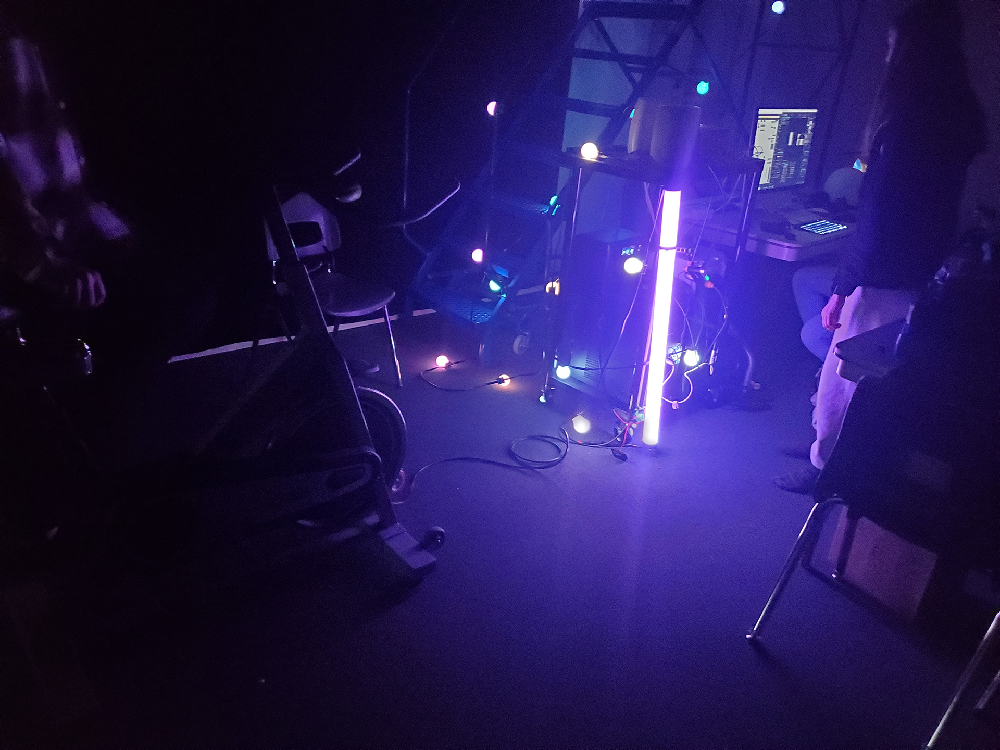

# Luma Sol
Créé par Éloïse Gagné, Skayla Stimphil, Michaël Simard et Pénélope Morrisson.

## L'installation en cours

## Lien avec Mycelium
Le projets EDRIA, fait un lien avec la nature et la technologie. Ils utilisent des fausses plantes dans leur installations pour faire penser au arbres, en même temps il utilise la technologie pour les lumières.
## Schéma de l'installation

Source de l'image: [Leur site web](https://tim-montmorency.com/2023/projets/LumaSol/docs/web/preproduction.html)

## Cours nécéssaire
Trois cours du programme qui sont nécéssaire à la création de ce projets.
* Taitement viédo
* Animation 2d
* Conception d'une expérience multimédia
## Composante technique
Pour ce projet, un capteur de.

## Mon ressenti 

