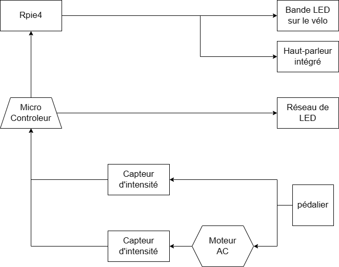

# Luma Sol
Créé par Éloïse Gagné, Skayla Stimphil, Michaël Simard et Pénélope Morrisson.

## L'installation en cours

## Lien avec Mycélium
Le projet Luma Sol fait un lien avec la nature et la technologie. Ils utilisent de fausses plantes dans leurs installations pour faire penser aux arbres, en même temps il utilise la technologie pour les lumières.
## Schéma de l'installation

Source de l'image: [Leur site web](https://tim-montmorency.com/2023/projets/LumaSol/docs/web/preproduction.html)

## Cours nécessaire
Trois cours du programme qui sont nécessaires à la création de ce projet.
* Traitement vidéo
* Animation 2D
* Conception d'une expérience multimédia
## Composante technique
Pour ce projet, un détecteur pour détecter qu’un visiteur utilise le vélo sera nécessaire.

## Mon ressenti 
Je pense que quand je vais voir le projet en action, je vais être impressionné. Faire du vélo et voir les lumières s'allumer ça va être amusant. Après avoir parlé aux créateurs, ils m’ont donné confiance que leur projet serait intéressant.

