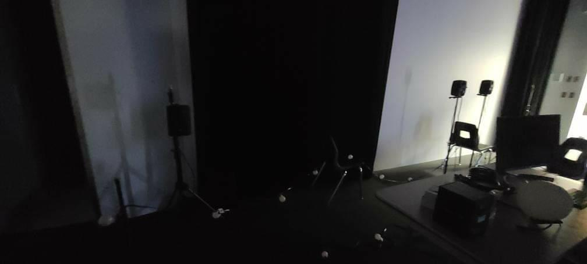

# Nexum
Créé par Sébastien Reilly, Sabrina Laforest, Alexandre Daniel et Maxime Des Lauriers.

## L'installation en cours

## Lien avec Mycelium
Le projets Nexum, fait un lien avec la nature et la technologie. Ils utilisent des plantes dans leur installations pour faire penser au arbres, en même temps il utilise la technologie pour les lumières. Voilà le lien avec Mycelium.
## Schéma de l'installation

Source de l'image: [Leur site web](https://tim-montmorency.com/2023/projets/Nexum/docs/web/preproduction.html)

## Cours nécéssaire
Trois cours du programme qui sont nécéssaire à la création de ce projets.
* Traitement vidéo
* Animation 2d
* Conceptin d'un projet mutlimédia
## Composante technique
Pour ce projet, une carte son sera néssésaire. Une carte son c'est un periferique qui peux généré du son sur un ordinateur. Pour pouvoir entendre la trame sonore du projet, la carte son sera une importante addition au projet.
Source pour cette information: [L'information](https://www.futura-sciences.com/tech/definitions/informatique-carte-son-18393/)

## Mon ressenti 
Oui leur projets dans le la salle avez l'aire un peu decevant, mais quand j'ai apris que les lumière vont s'allumer a ta position, j'ai été super intéresser. Marcher et avoir des lumière qui vont te suivre sa va être une experience que j'ai jamais vécu, sa va être choquants.

