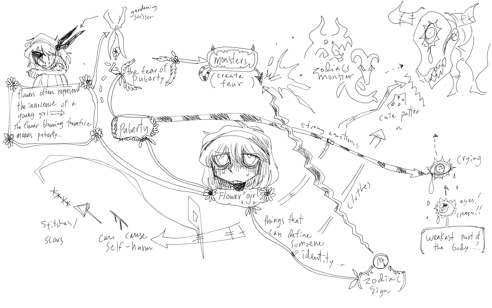

# Zodie-Gal
Créé par Abdanor Yara

## Lien avec Mycelium
Le projets Zodie-Gal fait un lien avec Mycelium, car elle fait une connection avec l'unrbanisation et la nature. 
## Schéma de l'installation

Source de l'image: [Son site web](https://tim-montmorency.com/2023/projets/Zodie-Gal/docs/web/preproduction.html)

## Cours nécéssaire
Trois cours du programme qui sont nécéssaire à la création de ce projets.
* Gestion d'un projet multimédias
* Intérgration web
* Introduction a la programmation multimédia
## Composante technique
De ce que j'ai compris sur le projet. Le jeux vas être sur une page web, alors pour le projet, une serveur web sera néssaire. Un serveur web c'est « ...un serveur web est un ordinateur qui stocke les fichiers qui composent un site web (par exemple les documents HTML, les images, les feuilles de style CSS, les fichiers JavaScript) et qui les envoie à l'appareil de l'utilisateur qui visite le site.»

Source pour cette information: [L'information](https://developer.mozilla.org/fr/docs/Learn/Common_questions/Web_mechanics/What_is_a_web_server)

## Mon ressenti 
Je pense que quand je vais expérimenté l'oeuvre, je serais deçus. Quand le fille ma explique le projet, je n'est pas vraiment compris. Je pense que juste avec se quelle ma dit le projet va être très difficile a comprendre.
