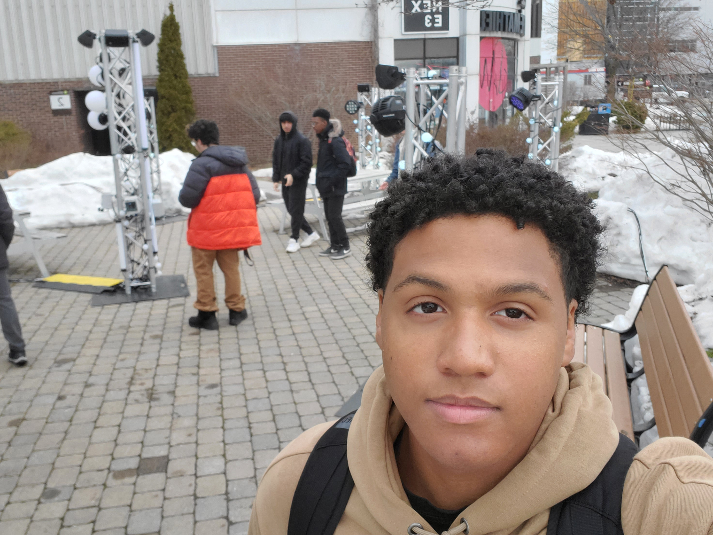
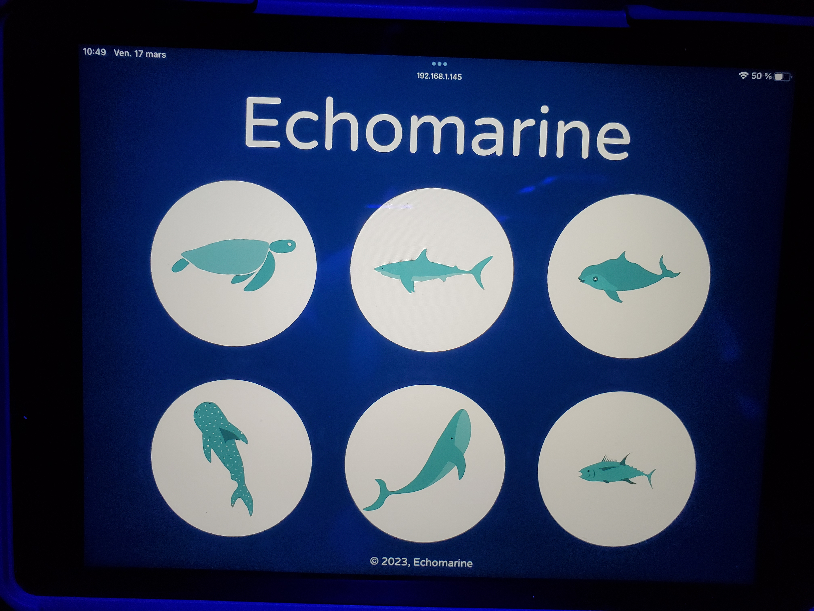

# Mycelium

Voici un photo de moi qui observre les projets finales de étudiant en troisième année.
#
## Echomarine

Le projets Echomarine était en exposition pendant une semaine en avril.
#
## Type d'exposition
Ce projets est une exposition temporaire. Elle était en exposition officiel pendant seulement une semaine.

## Description du Projet
« Une projection immersive controlée par un dispositif interactif qui nous donne un aperçu de la beauté des fonds marins tout en mettant de l'avant ses enjeux. Animaux interactifs et plantes marines, Echomarine a un but contemplatif et vise à conscientiser. »

Source de cette information: [Leur site](https://tim-montmorency.com/2023/projets/Echomarine/docs/web/index.html)
#
Voici une petite vidéo pour vous démontrez comment l'oeuvre fonctionnent. **cilquer la photo**

# Mise en espace
Le projet echomarine et placé dans une petite studio avec quatre mur les projections.

## Compsantes techniques
Pour que l'exposition soit exposée, il faut avoir ces composants techniques.
* Des projecteur.
* Une tablette.
* Des murs avec de l'espace pour les projections
* Des haut-parleurs

Photo d'un projecteur.

Photo de la tablette.

Photo d'un mur

## Expérience vécue
Ce qui est attendu d'un visiteur avec ce projets c'est de entrez dans le petit studio et explorer les différents défénition des animaux marin. Quand tu va cliquer sur les animaux, tu peux ensuite admirer les animaux se promener sur les mur du studio.

## Ce qui ma plus
J'aime vraiment aimer comment la petite salle donne vraiment l'impression d'être dans le fond de l'ocean. La combinaision du visuel sur les murs et le son, ça donne une expèrience vraiment intéressante.

## Quelque chose que je ne changerais pas
Quelque chose que je ne changerais pas sa serait les effets sonore quand tu entend des animaux marin se promene sur les murs. Je trouve que c'est un de elements qui rend le projet le plus immersife.
