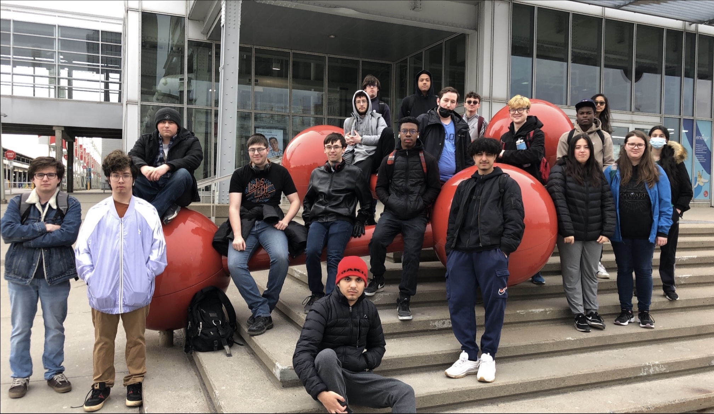
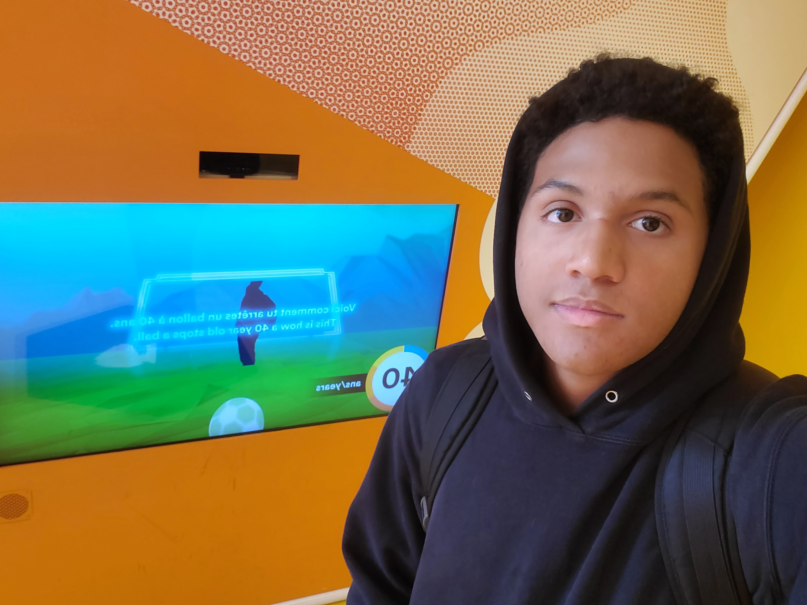
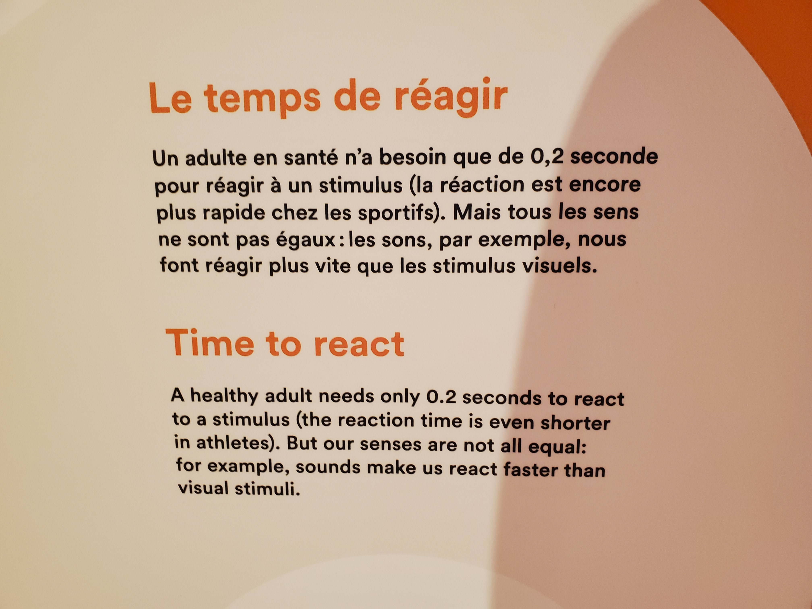
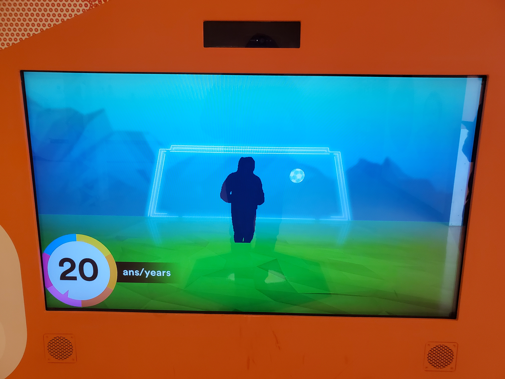

# Centre des sciences

#
## Pas facile de saisir la balle au bond

#
## Pas facile de saisir la balle au bond
Le dispositif Pas facile de saisir la balle au bond était en exposition au Centre des Sciences de Montréal.
J'ai visité cette exposition le 12 avril.
#
## Type d'exposition
Résonances c’est une exposition qui se passe à l'intérieure et qui est permanente, elle va rester la longtemps. Le nom du créateur du dispositif n'a pas été donné.

## Description du dispositif
Pas facile de saisir la balle au bond est un dispositif multimédia qui démontre le temps de réaction d'une personne selon son âge. Pour utiliser le dispositif, tu dois te placer sur une zone sur le sol et regarder l'écran. Sur l'écran une silhouette de toi sera dans un but de soccer. C'est une sorte de simulation de gardien de but au soccer. Aussi sur l'écran, on peut voir des balles en direction du but. Ton but en tant que quelqu'un qui veut utiliser le dispositif, c'est d'essayer d'arrêter les buts. Tu vas pouvoir faire plusieurs arrêts, mais le plus longtemps que tu passes à arrêter les buts, le plus de temps que ton personnage sur l'écran prendra pour bouger. Ceci est fait pour te faire réaliser que les gens plus âgés ont un temps de réaction plus lent. Tu es censée pouvoir vivre l'expérience de quelqu'un de plus âgé.
#

Voici une photo de la zone sur le sol.
#

Voici une photo de l'écran
#
Voici une petite vidéo pour vous démontrez comment l'oeuvre fonctionnent: [Video interactif]([https://youtu.be/2OLwPezuT4A](https://youtu.be/4xbXgVgLWYk))

## Plus d'information
Photo de mise en espace.

