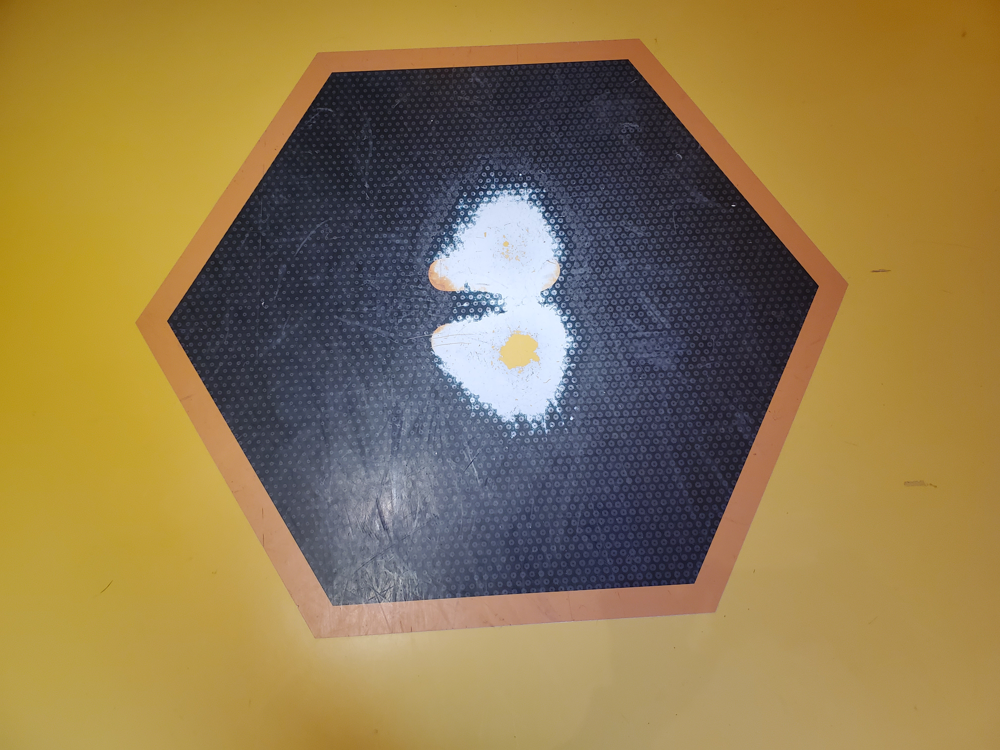
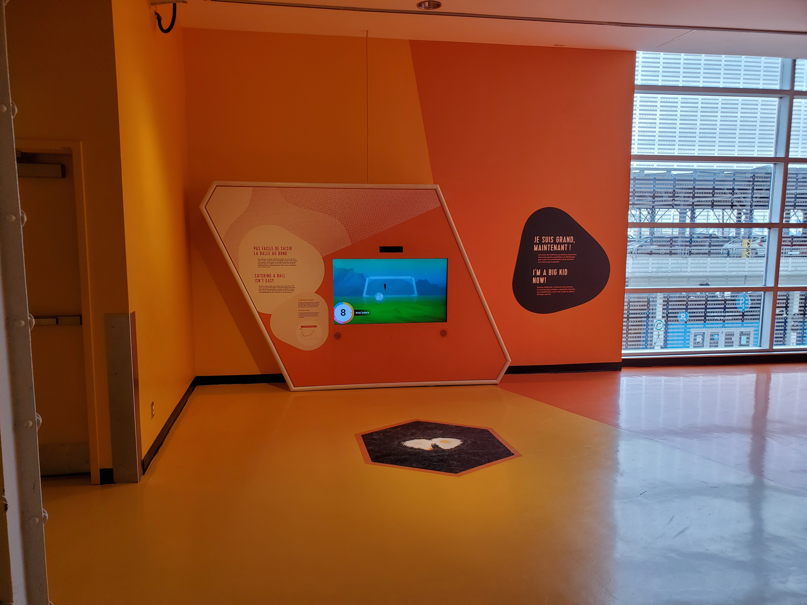
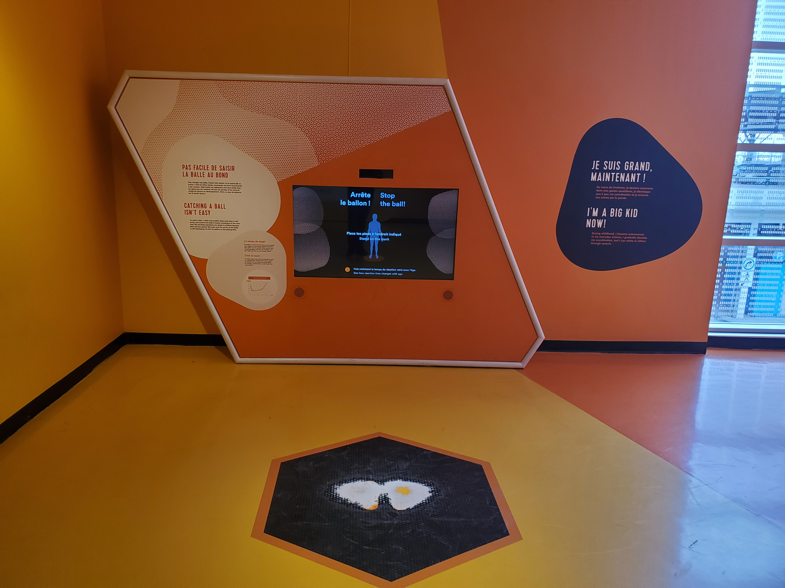
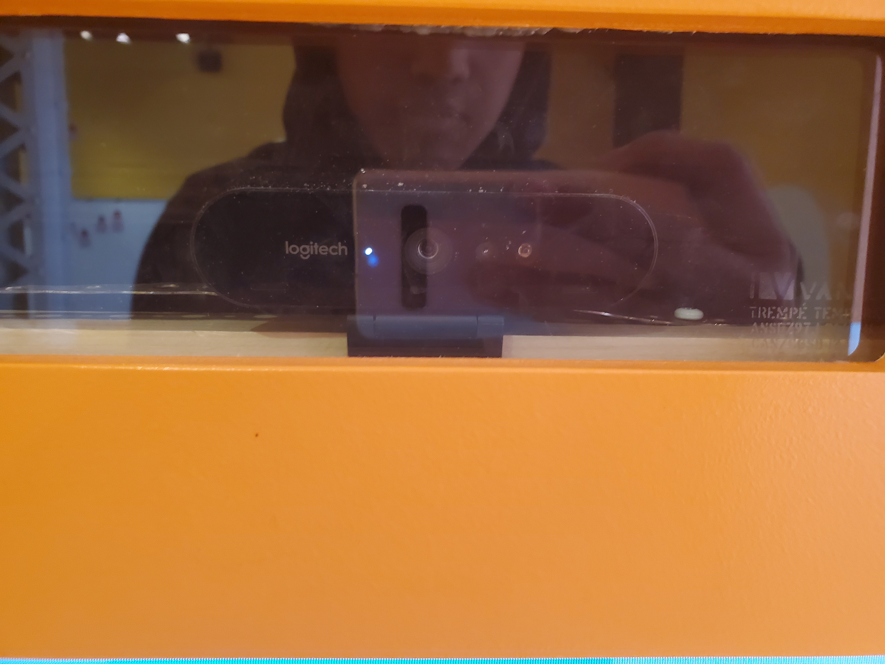
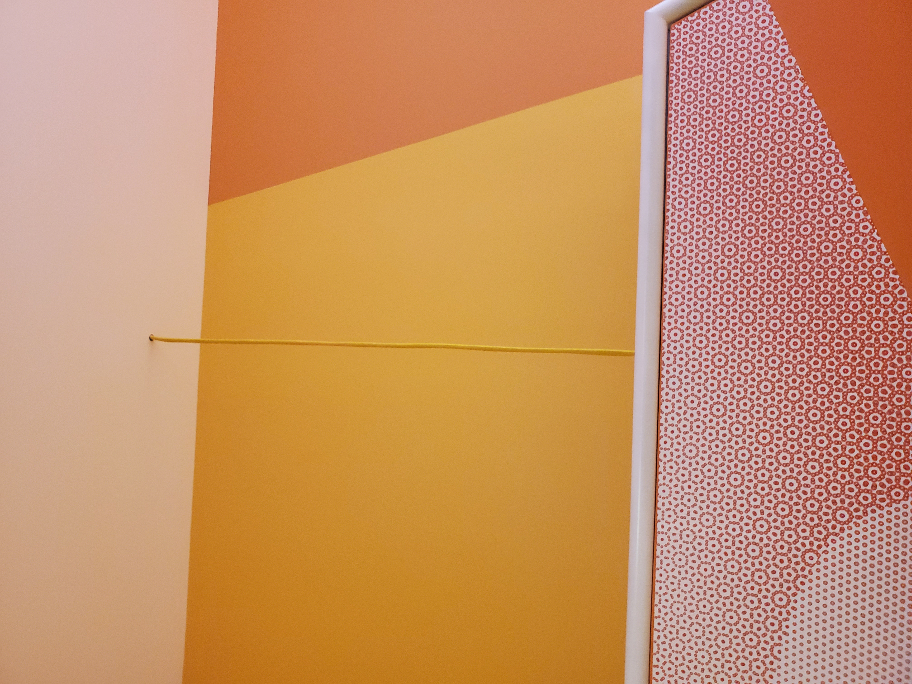

# Centre des sciences

#
## Pas facile de saisir la balle au bond

#
## Pas facile de saisir la balle au bond
Le dispositif Pas facile de saisir la balle au bond était en exposition au Centre des Sciences de Montréal.
J'ai visité cette exposition le 12 avril.
#
## Type d'exposition
Pas facile de saisir la balle au bond c’est une exposition qui se passe à l'intérieure et qui est permanente, elle va rester la longtemps. Je suis aller plusieur fois dans ma vie puis a chaque fois, ce dispositf était là. Le nom du créateur du dispositif n'a pas été donné.

## Description du dispositif
Pas facile de saisir la balle au bond est un dispositif multimédia qui démontre le temps de réaction d'une personne selon son âge. Pour utiliser le dispositif, tu dois te placer sur une zone sur le sol et regarder l'écran. Sur l'écran une silhouette de toi sera dans un but de soccer. C'est une sorte de simulation de gardien de but au soccer. Aussi sur l'écran, on peut voir des balles en direction du but. Ton but en tant que quelqu'un qui veut utiliser le dispositif, c'est d'essayer d'arrêter les buts. Tu vas pouvoir faire plusieurs arrêts, mais le plus longtemps que tu passes à arrêter les buts, le plus de temps que ton personnage sur l'écran prendra pour bouger. Ceci est fait pour te faire réaliser que les gens plus âgés ont un temps de réaction plus lent. Tu es censée pouvoir vivre l'expérience de quelqu'un de plus âgé.
#

Voici une photo de la zone sur le sol.
#

Voici une photo de l'écran
#
Voici une petite vidéo pour vous démontrez comment l'oeuvre fonctionnent: 

# Mise en espace
Photo de mise en espace.

Le dispositif est placé au deuxième étage du centre des sciences. Il est placé là, car c'est une œuvre permanente. Les œuvres temporaires du centre des sciences sont placées au premier étage. Le dispositif a été placé dans un couloir collé à un mur. Il faut beaucoup d'espace pour ce dispositif, car il faut une place pour mettre l'écran et une zone sur le sol pour l'utilisateur.

## Compsantes techniques
Pour que l'exposition soit exposée, il faut avoir ces composants techniques.
* Un capteur du genre Xbox Kinect pour capté le mouvement du joueur.
* Un grand écran pour jouer le role du gardien.
* Un file élécrique pour almimenté le dispositif.(Il utilise un file de la même couleur que le mur en arrière pour diminuer sa visibilité)
* Une zone sur le sol pour que l'utilisateur puisse ce placer a bonne endroit.

Photo du capteur.

Photo de l'écran.

Photo du file.

Photo de la zone sur le sol.

## Expérience vécue
Ce qui est attendu d'un visiteur avec cette œuvre c'est que le visiteur passe à travers la structure puis qu'il regarde les images de lui sur le grand écran. Pour moi, cette expérience était très amusante. Faire drôle de visage puis les voir apparaître sur le grand écran, ou laisser mon bras plus longtemps devant la caméra pour me donner de long bras. :laughing:

Ce qui est attendu d'un visiteur c'est qu'il ce place sur la zone a terre puis qu'il essait d'arreter le but qui seront tiré dans le but virtuel sur l'écran. Pour moi, cette expérience étais très intéressante. Sa ma fais comprendre a quel point quand tu viellie, ton temps de réaction devient plus lent.

## Ce qui ma plus
J'ai vraiment aimer comment le dispositf fait comprendre la viellesse et le temps de réaction. Donner le role de gardien de but au visiteur pis le faire essayer d'arrêter les buts ces très amusant.:heart:

## Quelque chose que je ne changerais pas
Je pense qu'une chose que je ne pourrait pas changer c'est le concepte. Cette idée est tellement créative. Il aurait pus juste pu crée quelque chose qui the dit de passer ta mais sur le rond rouge sur l'écran mais il on utilisé le sport du soccer. Le concepte du soccer est tout simplement trop bon pour être changé.

