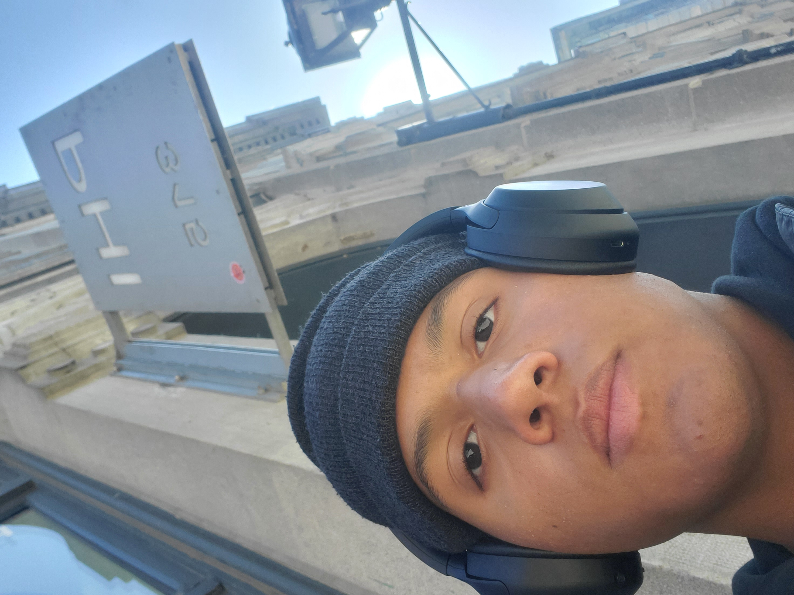
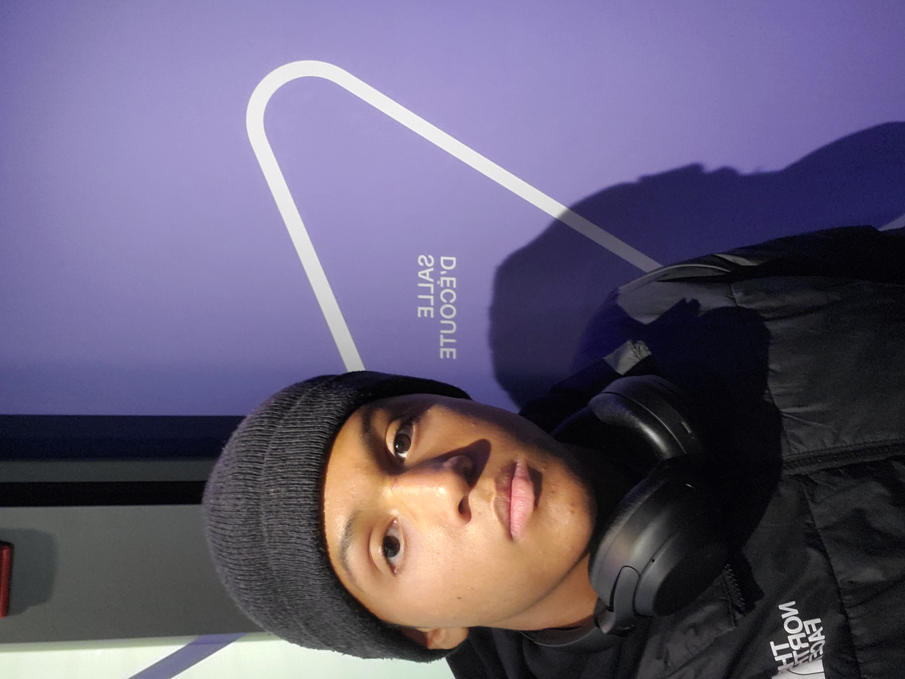
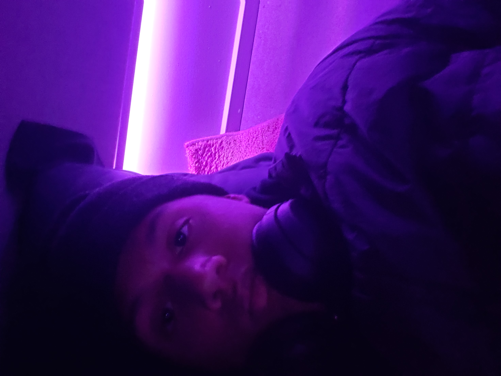
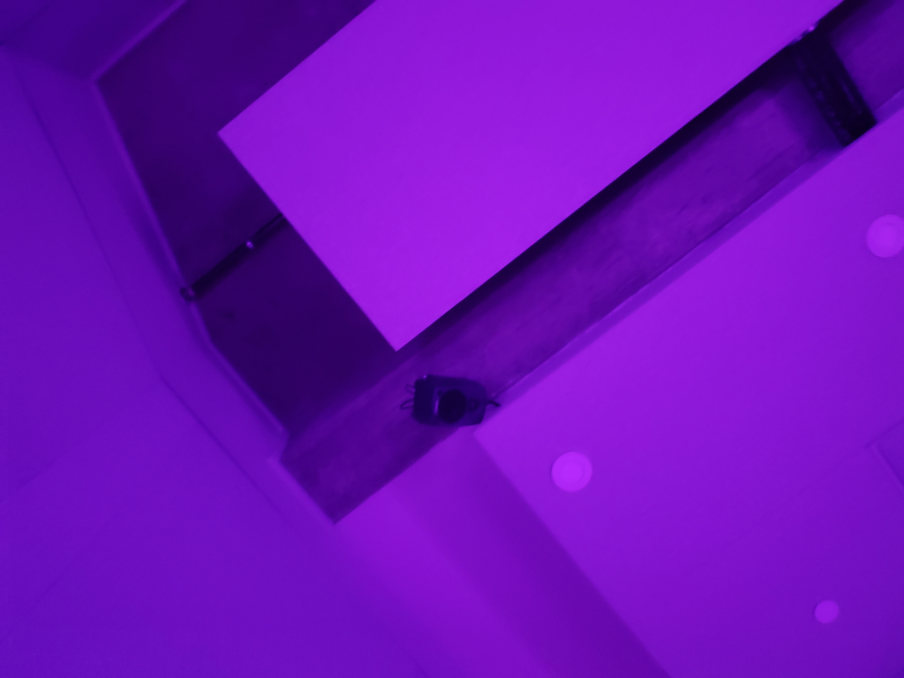
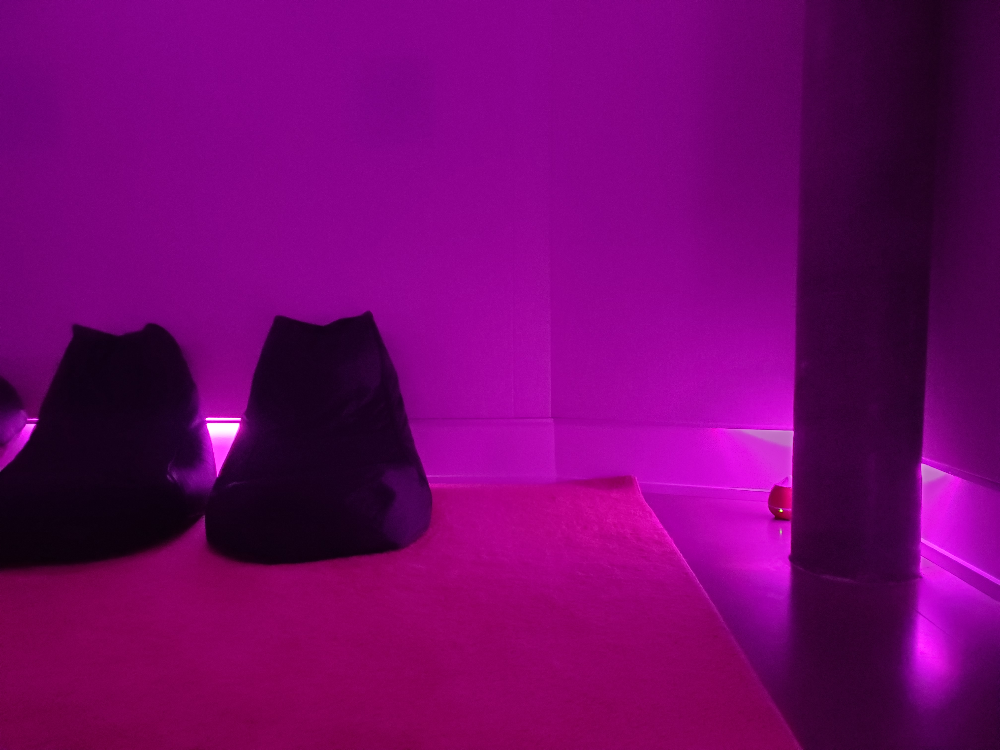
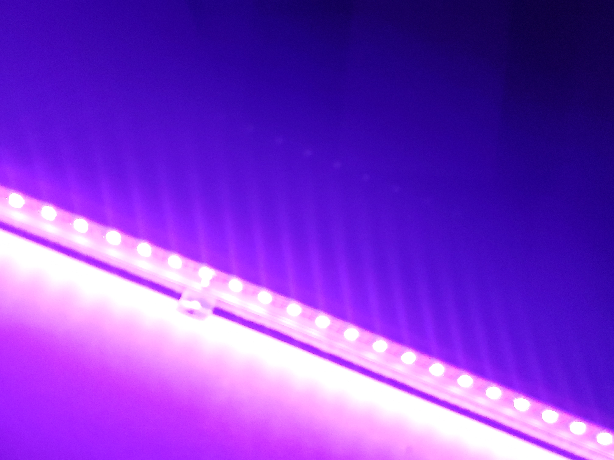

# Centre Phi

#
## Habitat Sonore

J'ai suis aller visité Habitat Sonore le 2 avril 2023.
## Type d'exposition
Habitat Sonore est une salle d'écoute qui est immersive.

## Description
Habitat sonore c'est une salle d'écoute pour écouter plusieur audio différentes. C'est un salle ou tu peux relaxer puis apprécier le son.
#

Voici une petite vidéo pour vous démontrez comment l'oeuvre fonctionnent. **cilquer la photo** 

# Mise en espace
La salle d'écoute est situé dans le sous-sol du Centre Phi. Elle placer seul derrière une porte, pour ne pas déranger les reste des exposition dans le centre phi.

## Compsantes techniques
Pour que habitat sonore soit en exposition, il faut avoir ces composants techniques.
* Haut-parleurs

Haut-parleurs

## Éléments recommandés
Voici des éléments qui ne sont pas obligatoire mais bien a avoir pour améliorer l'expérience du visiteur.
* Place confortable pour s'assoire.
* Des lumière LED pour l'ambiance.
* Tapis pour le confort.

Voici une photo des place pour s'assoire et du tapis.

Photo des LED

## Expérience vécue
Je trouver que mon expérience état pas très bonne principalement à cause l'audio qui a été jouer. Pour moi, ce que la madamme dans l'audio disait c'était un peux étrange. Elle fessait des bruit bizzare des cri puis quand elle parlais, sa voix avait de modification très bizzare.

## Ce qui ma plus
Même si l'audio était pas superb, la salle d'écoute était vraiment bien. Sa parait que la confort était quelque chose d'imporant pendant la création de cette salle, car le confort était trés bon. Le tapis pour quand tu marche c'est très bien pour les pieds. Je sais que sa un peux bizzare mais un tapis sa fait un gorsse différences. Ensuite il y a les place pour s'assoire qui étati très confortable. Et finalement, il y avait des lumière qui contribuer extrêmement bien a l'ambiance. Tout ces éléments on fait que le confort de la salle a été bien aprécié.

## Quelque chose que je changerais.
Je pense que c'est claire que j'ai pas adoré l'audio qui a été jouer quand j'étais là. Si j'était pour une sort de salle sonore, je choisirait des trame audio plus intéressante. J'aimais je jouerais cette audio dans ma salle ou dans un de mes projts. Je trouve que la selction d'audio est très imporante. Je voudrait m'assurer que toutes les trames audio qui vont jouer dans la salle soit excellente.
